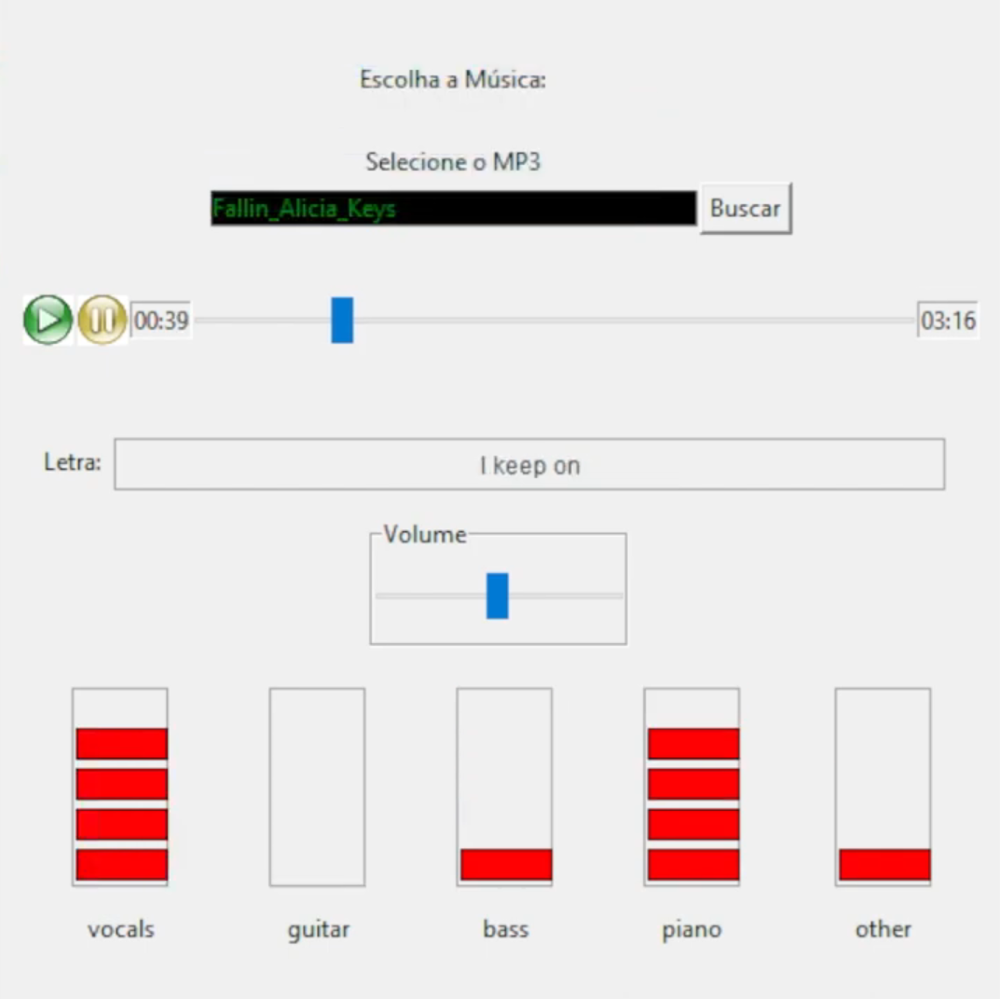
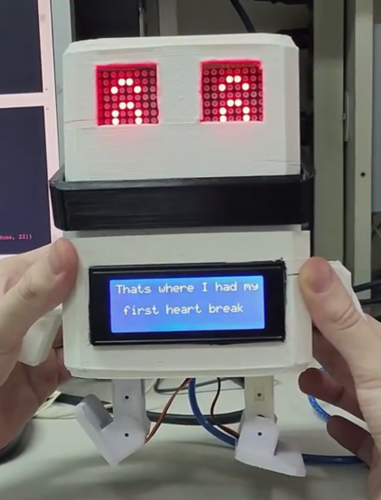

# [ENG1419] Microcontroller Programming - Singing & Dancing Robot
* **Course:** ENG1419
* **Semester:** 2022.2
* **Supervisor:** Jan Krueger Siqueira
* **Presentation:** [Vídeo Presentation](https://youtu.be/-tEMb2AIHG4?si=3t7y8_Aj2SXnBPZG)
* **Group Members:**
  * Pedro Gabriel     - Interface 
  * Rafael Vilela     - Robot Motion
  * Douglas Medeiros  - Robot Construction
  * Fernanda Basso    - Songs data

## Description
Repository of the interface module related to the Final Project carried out during the ENG1419 - Microcontroller Programming course at PUC-Rio 2022.2

## Interface - MP3 Player

MP3 Player for Microcontroller Programming - ENG1419 at Pontifical Catholic University of Rio de Janeiro

## What it is?

This is the interface module, that reproduces songs, show it lyrics on the robot belly and gives information to be used for the robot to move.

  

## How it works?

This Player will help a robot play songs that are stored in the program. The songs and lyrics folder are not included in this repository. When a song is played, it shows the lyrics in his belly and song metrics like vocals, drums, piano levels and the robot will move and his eye lights will adapt to it to match the song. 

  

## Academic Integrity Notice
The code in this repository represents my group solutions to the Microcontroller Programming main project.

* Use it to **learn**, not to **copy**
* Understand the logic before applying similar approaches
* Remember that struggling with a problem is part of the learning process

*Current students, respect your course's academic integrity policies.*
